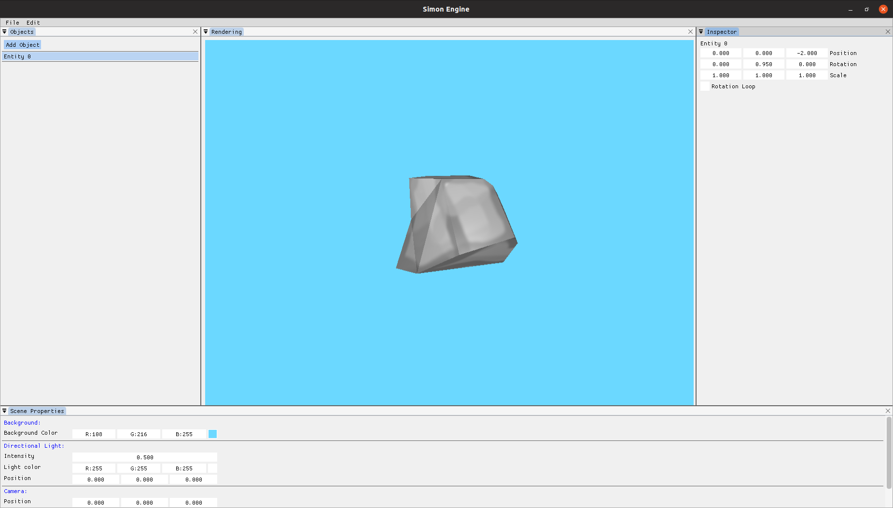

# Simple Render Engine

A Simple 3D Rendering Engine, using OpenGL, ImGui and GLFW in C++. Current features:

- 3D OpenGL Context with VAO, VBO, FBO and Index Buffer

- Fragment and Vertex Shader in GLSL

- Graphic UI

- Twekable object properties

- Ortographic/Perspective camera switch

- .obj importer

  


## Getting Started

Now we are going to see how to set up and run the engine. Tested only on Ubuntu 18.04 64 bits.

### Dependencies

Before running the program, we need to download and install some dependencies:

**Glew**

```
sudo apt-get install libglew-dev
```

**OpenGL**

```
sudo apt-get install libgl-dev
```

**GLFW**
```
sudo apt-get install libglfw3-dev
```


**SFML** (used just for keyboard inputs)

```
sudo apt-get install libsfml-dev
```


### Running

To run the program, ``make`` on the root folder.

On the root folder:

```
make
```

Then:

```
./run
```

## Acknowledgments

* Thanks to ThinMatrix for the inspiration
